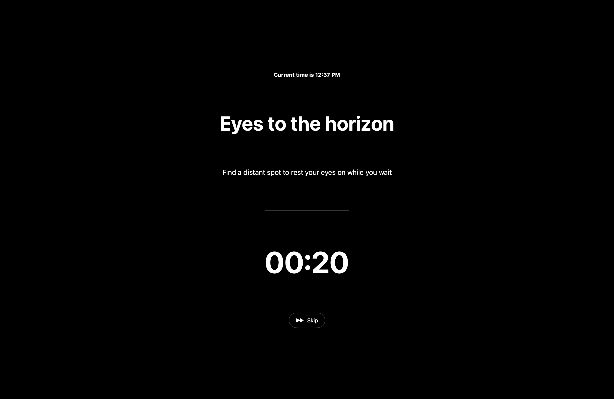

# EyeBreak - Free Open Source Alternative to LookAway (Mac) 

EyeBreak is a macOS app that helps reduce eye strain by reminding you to take regular breaks. It's a straightforward alternative to paid apps like LookAway ($15 lol).




## Features

- Menu bar app with sleek UI
- Break reminders with elegant black fullscreen interface
- Smooth animations for break screens
- Customizable break timers
- Multiple pause durations (10 min to 24 hours)
- Options to add 1 or 5 minutes to next break
- Skip break functionality

## How It Works

1. The app runs in your menu bar with a 👀 icon
2. Every 20 minutes(customizable), it displays a fullscreen break reminder
3. During the break, look away from your screen at something distant
4. The break lasts for 30 seconds(customizable) by default
5. You can skip the break if needed

## Building the App

### Requirements
- macOS 10.15 or higher

### Build Instructions

1. Open Terminal
2. Navigate to the project directory
3. Run the build script:

```bash
./build.sh
```

4. The script will create EyeBreak.app in the current directory
5. You can move it to your Applications folder with:
```bash
mv EyeBreak.app /Applications/
```

## Customizing

You can customize the break interval by modifying the `timeUntilBreak` variable in the `main.swift` file. The default is 20 minutes (1200 seconds).

Break duration can be adjusted by changing the `breakDuration` variable (default is 30 seconds).

## License

MIT
